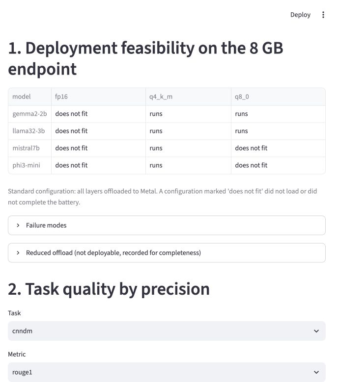
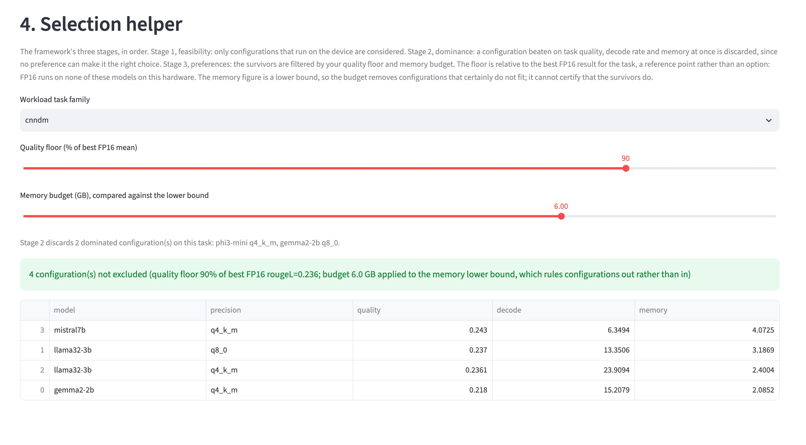

# slm-quant-bench

Reproducible benchmarking of quantisation-compressed small language
models for privacy-preserving enterprise deployment on consumer
hardware. Built for the MSc dissertation by Abdullah Abdullah,
WMG, University of Warwick (2026).

> **Release status:** public code-only release accompanying the
> submitted dissertation. Model weights and GGUF files are deliberately
> excluded from version control; everything needed to re-derive the
> reported numbers from the committed records is here.

## Start here

- **Explore the completed results:** run the dashboard. No model download
  or inference is required.
- **Try local question answering:** run the demonstrative RAG prototype
  with a locally obtained GGUF model.
- **Evaluate your own hardware:** edit the YAML configurations and run a
  scoped quality or efficiency battery.
- **Reproduce the dissertation:** follow the complete experimental sequence
  under [Full reproduction](#full-reproduction).

## What it does

Evaluates 4 instruction-tuned SLMs (Phi-3 Mini, Gemma 2 2B, Llama 3.2
3B, Mistral 7B) at 3 precisions (FP16, Q8_0, Q4_K_M GGUF) across
enterprise NLP tasks (CUAD, HotpotQA, CNN/DailyMail, TruthfulQA, plus a
curated UK public-sector corpus), measuring task quality on a reference
GPU and efficiency + feasibility on an 8 GB consumer laptop.

The measurement split is deliberate: **quality** is a function of
weights, prompt and decoding policy, so it is scored in a reproducible
reference GPU environment (Colab T4); **efficiency and feasibility**
depend on the hardware, so they are measured on the target endpoint
itself (MacBook Air M2, 8 GB, Metal). A matched-subset agreement check
validates that split rather than assuming it.

Headline findings on the tested 8 GB endpoint:

- FP16 completed the device battery for 0 of 4 models.
- Q8_0 completed it for 2 of 4 models.
- Q4_K_M completed it for all 4 models.
- Feasible configurations decoded at median rates between 6.3 and
  23.9 tokens per second.

## Dashboard

The dashboard reads the committed result files. It does **not** download or
run a language model, so it is the quickest way to inspect the evidence.

### Five-minute dashboard quick start

```bash
git clone https://github.com/abdullahajaz14/slm-quant-bench.git
cd slm-quant-bench
python3 -m venv .venv
source .venv/bin/activate
python -m pip install streamlit==1.61.1 pandas==3.0.3
streamlit run dashboard/app.py
```

On Windows PowerShell, activate the environment with:

```powershell
.\.venv\Scripts\Activate.ps1
```

Then open `http://localhost:8501`. The dashboard provides:

1. the full device-feasibility matrix;
2. task and metric selection with confidence intervals;
3. measured device-efficiency results; and
4. a selection helper applying the dissertation's three-stage
   procedure: keep what runs on the endpoint, discard what is
   Pareto-dominated on the chosen task's quality, decode rate and
   memory, then filter by a quality floor and a memory budget.

Memory is compared against a conservative lower bound, the larger of
peak resident memory and model-file size. Because it is a lower bound it
can rule a configuration out but cannot certify that one fits, so the
helper reports what is **not excluded** rather than what qualifies.





If the dashboard reports that `results/degradation.csv` is missing, run the
analysis command under [Full reproduction](#full-reproduction) and reload.

## Installation for evaluation and reproduction

Python 3.11+ (developed on 3.13). From the repository root:

```bash
python3 -m venv .venv
source .venv/bin/activate
python -m pip install --upgrade pip
python -m pip install -e .
python -m pip install -r requirements.txt
```

Windows PowerShell users should replace `source .venv/bin/activate` with
`.\.venv\Scripts\Activate.ps1`. The analysis and dashboard are
platform-independent. Model execution requires a `llama-cpp-python` build
appropriate to the machine's backend:

- **macOS on Apple silicon:** Metal is the tested target backend and is
  enabled automatically by llama.cpp's normal macOS build.
- **Linux:** CPU or CUDA execution can be used with a compatible build, but
  its efficiency figures are not directly comparable with the dissertation's
  Apple-silicon results.
- **Windows:** the dashboard and analysis run normally in PowerShell. The
  Bash conversion helper requires WSL or Git Bash; alternatively, perform the
  llama.cpp conversion and quantisation commands manually.

For model conversion and the on-device runs you also need llama.cpp
and its Python bindings:

```bash
# llama.cpp (converter + quantiser); Metal is enabled automatically on macOS
git clone --depth 1 https://github.com/ggerganov/llama.cpp ~/llama.cpp
cd ~/llama.cpp && git checkout 571d0d540df04f25298d0e159e520d9fc62ed121
cmake -S ~/llama.cpp -B ~/llama.cpp/build -DCMAKE_BUILD_TYPE=Release
cmake --build ~/llama.cpp/build -j --target llama-quantize

# conversion dependencies
.venv/bin/pip install torch transformers sentencepiece
```

Gated models (Llama 3.2, Gemma 2) require accepting their licences on
Hugging Face and authenticating locally:

```bash
.venv/bin/hf auth login     # paste a read token; verify with: hf auth whoami
```

Disk: the download/convert/quantise pipeline needs roughly 25-30 GB of
transient headroom per model family (raw weights plus the FP16 GGUF
exist simultaneously). Bulk artefacts may live on external storage, but
**the efficiency battery must read its GGUF from internal disk**:
llama.cpp memory-maps the model, so on a memory-constrained machine
pages are re-read during generation and external-bus latency would
contaminate the decode-rate measurement.

## Model files and licences

No model weights or GGUF files are published in this repository. The
repository ignores `/weights/`, `/models/` and `*.gguf` so that multi-gigabyte
artefacts cannot be committed accidentally. Each user must obtain the model
from its original publisher, accept any applicable terms, and create or
provide a compatible GGUF file locally.

The conversion helper supports these model keys:

```text
phi3-mini
gemma2-2b
llama32-3b
mistral7b
```

For example:

```bash
bash scripts/download_convert.sh gemma2-2b
```

This writes `models/gemma2-2b-fp16.gguf`,
`models/gemma2-2b-q8_0.gguf` and
`models/gemma2-2b-q4_k_m.gguf`. The checksums later in this README identify
the exact study artefacts, but the model publishers' licences continue to
govern the weights and derived GGUF files.

## On-device RAG prototype

`scripts/rag_demo.py` is a deliberately small, local demonstration rather
than part of the controlled experiment. It retrieves paragraph chunks from
the committed UK public-sector corpus with TF-IDF cosine similarity and asks
the selected quantised model to answer from those passages.

With a compatible GGUF file available, run from the repository root:

```bash
python scripts/rag_demo.py \
  --gguf models/gemma2-2b-q4_k_m.gguf \
  --model-key gemma2-2b \
  --question "How much Statutory Sick Pay can you get per week?"
```

Optional flags are `--top-k` for the number of retrieved chunks and
`--max-tokens` for the generation limit. The documents, retrieval and model
inference remain on the local machine. A recorded three-question run is in
`results/rag_demo_transcript.md`; it deliberately retains one incorrect
answer to demonstrate that retrieval grounding does not guarantee correct
fact selection.

## Test

```bash
.venv/bin/python -m pytest tests/ -q          # unit + golden tests
RUN_DATA_TESTS=1 .venv/bin/python -m pytest   # also runs dataset smoke tests
```

The normal suite contains 32 passing tests and one opt-in dataset test
that is skipped unless `RUN_DATA_TESTS=1` is set. It covers the dataset
adapters, the prompt layer, every scorer against golden files, and the
three-stage selection logic pinned to the committed result records, so a
change that altered a published figure would fail the suite.

## Full reproduction

Reproduction can be stopped at the level appropriate to the question:

- **Seconds, no inference:** inspect the dashboard or re-run analysis over
  the committed records.
- **Minutes:** run the smoke configuration on one local model.
- **A scoped device study:** restrict the YAML configuration to the models,
  precisions and tasks relevant to the user's hardware.
- **Complete study:** run the full sequence below.

1. Build the corpus artefacts (already committed; rebuild is idempotent):
   `python scripts/corpus_fetch.py <doc_id> <url> <publisher>`,
   then `python scripts/corpus_clean.py`,
   `python scripts/build_battery.py`, `python scripts/build_ukps_items.py`
2. `bash scripts/download_convert.sh <model>` for each model
3. Smoke test: `python scripts/run_quality.py --config configs/runs/smoke.yaml`
4. Pilot, then freeze: `python scripts/run_quality.py --config configs/runs/pilot_device.yaml`
   and `python scripts/pilot.py --pilot-jsonl results/pilot-device.jsonl`
5. Colab quality sweep: `notebooks/quality_colab.ipynb` (one model per session)
6. Device efficiency: `python -m slmbench.measure --config configs/runs/efficiency_device.yaml`
   (FP16 rows one at a time with `--only <model>:fp16`)
7. Agreement check: `python scripts/agreement_check.py --device results/agreement-device.jsonl --colab results/quality-colab.jsonl`
8. Analysis and figures: `python scripts/analysis.py --jsonl results/quality-colab.jsonl`
   then `python scripts/figures.py` (writes PDFs into `figures/`)
9. Dashboard: `streamlit run dashboard/app.py`

All runs are **resumable**: results are appended as JSONL and completed
(model, precision, task, item) keys are skipped on re-run, so an
interrupted session is continued by re-issuing the same command.

## Data artefacts

- `data/ukps/documents/` — 26 UK public-sector documents (GOV.UK, NHS)
  under the Open Government Licence v3.0, with
  `data/ukps/documents/INDEX.csv` recording source URL, publisher,
  licence and access date per document.
- `data/ukps/items.jsonl` — 60 span-based QA items and 25 reference
  summaries built by `scripts/build_ukps_items.py`; passages are sliced
  verbatim from source documents and every answer is verified to appear
  verbatim in its passage (the adapter re-checks this at load time).
- `data/battery.jsonl` — the 30-prompt efficiency battery (10 each
  short/medium/long), drawn from the same corpus.
- `data/ukps/LABLOG.md` — construction lab log, including the blind-rule
  authoring dates for the reference summaries.

## Repository structure

```text
slm-quant-bench/
├── configs/       model, task and run definitions in YAML
├── dashboard/     interactive Streamlit results and selection tool
├── data/          curated corpus, source index and device battery
├── docs/          README screenshots
├── notebooks/     pinned Colab quality-sweep notebook
├── results/       versioned records and derived summaries
├── scripts/       conversion, execution, analysis and RAG entry points
├── src/slmbench/  framework package: adapters, backend, scoring and storage
└── tests/         unit, golden and optional dataset tests
```

Local `models/`, `weights/` and `.venv/` directories are ignored and are not
part of the public repository.

## Record of runs

Environment captured with every result record (see any `env` field).
Device: MacBook Air M2, 8 GB unified memory, macOS 26.4.1, Metal
backend, Python 3.13.2.

### Model artefacts

All built 5 August 2026 with `scripts/download_convert.sh` on the target
device. Sizes and SHA-256 sums of the GGUF files actually used:

| Model | Precision | Size | SHA-256 |
|---|---|---|---|
| gemma2-2b | fp16 | 4.9 GB | `78df4989be5fabb16fd6b7fb868a8f77b6e19cced42801ec9813449d9f926689` |
| gemma2-2b | q8\_0 | 2.6 GB | `a17e17e9e4f6830aeb8e50cb097e5deb23d0aa33308fad3f75de624c3b281e3d` |
| gemma2-2b | q4\_k\_m | 1.6 GB | `f7b28bbcc7841d4b6d91abd0a355eb2339e099c7d7791def0ae13bd035e947a3` |
| llama32-3b | fp16 | 6.0 GB | `104652fe61578e61ff3abb82e6e1abf5f024c0847532c207979c45a1ce29a514` |
| llama32-3b | q8\_0 | 3.2 GB | `e2195045a7d1245c698a740f13b3d74f586e88e32482c925b9dc72bca82c4df0` |
| llama32-3b | q4\_k\_m | 1.9 GB | `2c2ba0ca12270ebba67e565d58ee9b7e14475dee33872ab5c2b493ac12f52e3c` |
| phi3-mini | fp16 | 7.1 GB | `f53d06d3c9c7e8a5638d08ec21381f2a39076bb817c8110688a306da3c5fc5a2` |
| phi3-mini | q8\_0 | 3.8 GB | `49a323d0b284896256bcb741c5ca60fee85ac8268f9d878cf97bc6cc150340f4` |
| phi3-mini | q4\_k\_m | 2.2 GB | `fcc2c8d0536acea1b8751eb406453a589ba4d98ec549bf520732bee27523bf1d` |
| mistral7b | fp16 | 13.5 GB | `bea976a17991502bf30de66e4098d54559e55ed363d2d7e897a125a68e3aeff9` |
| mistral7b | q8\_0 | 7.2 GB | `cddd1f75d501897a4c8c62af3ed587eb69d5719dfb4739a91b59531ea3763c3c` |
| mistral7b | q4\_k\_m | 4.1 GB | `73a0290ad48dd2f00a97704b0349484a31b1d3002de17643e288a7835445b1b7` |

Built with llama.cpp pinned at commit `571d0d540df04f25298d0e159e520d9fc62ed121`
(18 July 2026); the Colab notebook pins the same commit so both sides of
the cross-backend agreement check quantise with identical tooling.

Build wall-clock, for reference: gemma2-2b 12 min, llama32-3b 25 min,
phi3-mini 28 min, mistral7b 65 min (download, FP16 conversion and both
quantisations, on the target device).

### Runs

| run_id | date | environment | notes |
|---|---|---|---|
| smoke-ukps | 2026-08-05 | device / metal | End-to-end check on the curated corpus, gemma2-2b q4\_k\_m, 5 items per task. Adapter, prompt layer, backend, scorers and results store all exercised; 10 records, 0 errors. |
| template check | 2026-08-05 | device / metal | Per-model chat-template inspection required by the framework verification in Chapter 3. All four models rendered through their own chat format at q4\_k\_m and answered a grounded question correctly. |
| pilot-device | 2026-08-05 | device / metal | Pilot protocol and feasibility diagnosis; 600 records, including the 150 expected `llama_decode -3` failures for Phi-3 Mini Q8\_0 that motivated the split design. |
| pilot-colab | 2026-08-08 | Colab T4 / CUDA | Reference-environment pilot; 450 records, 0 errors. |
| quality-colab | 2026-08-08–09 | Colab T4 / CUDA | Full public-benchmark quality sweep; 27,408 records, 0 errors. |
| ukps-colab | 2026-08-08–09 | Colab T4 / CUDA | Full curated-corpus sweep; 1,020 records, 0 errors. |
| efficiency-device | 2026-08-08 | device / metal | Complete 24-row feasibility and efficiency battery. |
| agreement-device | 2026-08-08–09 | device / metal | Device half of the 400-record cross-backend agreement check; 0 errors. |

## Dataset ids actually used

Confirmed by loading each one on 5 August 2026 with `datasets` 5.0.0.
Two of the originally planned identifiers no longer resolve, so the
configurations carry the working ones:

| Task | Identifier used | Config | Split | Rows |
|---|---|---|---|---|
| CUAD | `theatticusproject/cuad-qa` at revision `refs/convert/parquet` | - | test | 4,182 |
| HotpotQA | `hotpotqa/hotpot_qa` | distractor | validation | 7,405 |
| CNN/DailyMail | `abisee/cnn_dailymail` | 3.0.0 | test | 11,490 |
| TruthfulQA | `truthfulqa/truthful_qa` | multiple\_choice | validation | 817 |

Two notes for reproduction:

- The CUAD repository ships a legacy dataset loading script, which
  `datasets` 5.x refuses to execute. The Hub's automatic parquet export
  carries identical content, so the configuration pins that revision.
- The bare identifiers `hotpot_qa` and `truthful_qa` no longer resolve;
  the namespaced forms above are the canonical ones.

The curated UK public-sector corpus loads from `data/ukps/items.jsonl`
and needs no download.

## Troubleshooting

### `ModuleNotFoundError: No module named 'slmbench'`

Run `python -m pip install -e .` from the repository root and retry from the
same activated virtual environment.

### `streamlit: command not found`

Activate the virtual environment and run
`python -m pip install -r requirements.txt`, or install only the dashboard
dependencies shown in the quick start.

### Hugging Face returns 401 or 403

Accept the relevant model licence on its Hugging Face page, then run
`hf auth login`. Gemma 2 and Llama 3.2 are gated models.

### The RAG demo says that no corpus documents were found

Run the command from the repository root. The expected documents are under
`data/ukps/documents/`.

### A GGUF file cannot be found

Model files are intentionally excluded. Supply the path to a locally obtained
GGUF file or run `scripts/download_convert.sh` after installing llama.cpp and
authenticating with Hugging Face.

### `llama_decode returned -3` or the model does not complete

Treat this first as a feasibility result. Close background applications and
try a smaller quantisation or shorter context before changing the framework.
The dissertation's 8 GB endpoint produced this error consistently for several
otherwise valid artefacts.

### Device measurements are unexpectedly slow

Read GGUF files from internal storage, close background applications, use
mains power and allow cooldown between configurations. Do not compare a
single interactive generation with the dissertation battery, which reports
medians over 90 generations.

## Citation

Until a DOI is assigned, cite the dissertation and repository as:

```bibtex
@mastersthesis{abdullah2026slmquantbench,
  author  = {Abdullah, Abdullah},
  title   = {Evaluating Quantisation-Compressed Small Language Models for
             Privacy-Preserving Enterprise AI Deployment on
             Resource-Constrained Hardware: A Framework for Regulated
             Sector Model Selection},
  school  = {University of Warwick},
  year    = {2026},
  type    = {MSc dissertation},
  note    = {Code and reproducibility artefacts: slm-quant-bench}
}
```

## Licence

Framework code: MIT (see `LICENSE`). Datasets and models: their
respective licences, recorded above. Curated corpus texts: Open
Government Licence v3.0, sources in `data/ukps/documents/INDEX.csv`.

Generated model outputs and benchmark records may remain subject to the
original model and dataset terms. Review those terms before redistributing a
derived result bundle.
